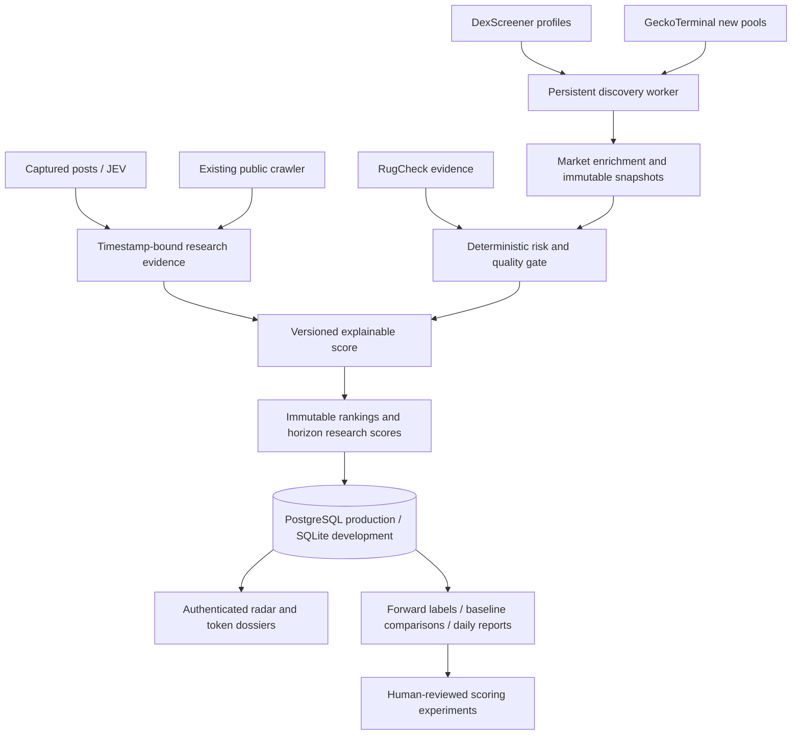

# Solana discovery architecture

Audit baseline: `a28e1b9` (2026-10-07). No application database is committed;
the existing engine creates `data/gem-search.sqlite` at runtime.

## Existing repository audit

| Area | Finding and reuse |
|---|---|
| README / SETUP / SECURITY | Local single-user research engine; public hosting cannot expose its session/pairing endpoints. |
| app.py | Standard-library HTTP server, SQLite projects/observations/runs/events, bounded DNS-pinned crawler, 30-minute crawl cache, local research checks. Reuse crawler and signal extraction. |
| automation.py | Durable launch queue, HN poller, inbox worker; Unix `fcntl` lock. Keep launch engine isolated; never call enqueue from radar. |
| jev.py | Deduplicated visible-post captures, author diversity, copied-text detection, small bilingual narrative taxonomy. Reuse captured evidence with capture-time cutoff. Browser collection still requires an open browser. |
| grok.py | Four concurrent optional xAI requests, schema/citation validation, persistent request allowance and cache. Extend token prompts; deterministic checks remain authoritative. |
| launch_provider.py / launch/ | PumpPortal creation, external bridge, conservative submission recovery, signing and SOL caps. No discovery feed or holder analytics exists. Excluded from hosted radar. |
| extension/ | MV3 localhost pairing, visible-post extraction, persistent bounded outbox, animated overlay. Preserve the existing contract. |
| static/ | Existing research/launch dashboard and downloadable capsules. Preserve at the local endpoint; add a separate responsive radar. |
| tests/ | Offline research, Grok, SSRF, queue/provider and extension tests, unsigned fixture and HTTP smoke scripts. Add independent radar tests. |
| .github/workflows/ci.yml | Ubuntu Python/Node tests, smoke scripts and extension ZIP. Add radar validation without changing launch behavior. |
| configuration | .env loader; paid X and Grok opt-in, launches dry-run. Radar gets its own environment configuration and never reads wallet keys. |

## Design

Provider data is not transaction-level ground truth. Profiles are promoted or
updated listings, not mint creation events. GeckoTerminal observes pools, not all
Solana launches. Pool age is not token age. Deduplicate by mint and pool, retain
all provider observations, choose a liquid primary market without summing
overlapping providers. Preserve missing market cap separately from FDV.

Every observation records server availability time and provider-reported time.
Every decision freezes its features, risk, evidence, rule version, universe and
rank. Evaluation joins only future labels, never future features. Returns are
sampled mark-to-market research returns, exclude fees/slippage and are not
executable profit. Missing prices, illiquid exits and late labels remain explicit.
Scores per horizon are uncalibrated research scores until sufficient independent
forward cohorts exist. No historical alpha or calibrated probability is claimed.

Production uses a separate read-only radar API with authentication; the old
localhost write/launch API is never published. A persistent container worker
uses PostgreSQL with a single-worker lease. Retries, provider cooldowns, budgets,
age-based polling and health timestamps are visible. Secrets stay server-side.

## Evidence gaps and remaining research

Creator clusters, bundled-wallet attribution, LP lock verification, sell
simulation, creator history and historically profitable wallet classifications
need authenticated transaction/holder history. Missing intelligence must stay
unknown and contributes no unsupported score. Do not label a large holder smart.
Licensed unattended social collection requires a provider; the browser extension
alone cannot provide 24/7 X data. Recall is relative to the observed universe,
not every Solana mint. Walk-forward results require accumulated mature cohorts.

## Provider references checked 2026-10-07

- [DexScreener reference](https://docs.dexscreener.com/api/reference): profiles,
  token-pairs and token market data; profile feed has selection bias.
- [GeckoTerminal API](https://api.geckoterminal.com/docs/index.html): Solana
  new-pool and token-pool endpoints; public service is rate limited.
- [Jupiter token information](https://developers.jup.ag/docs/tokens/token-information):
  recent first-pool discovery is a useful later authenticated source.
- RugCheck public reports are supplementary evidence, never a safety certificate.

Deployment completion requires a reachable hosted URL, configured database,
running worker, live provider checks and authenticated production health checks.
A Docker image or passing local test is not production completion.
