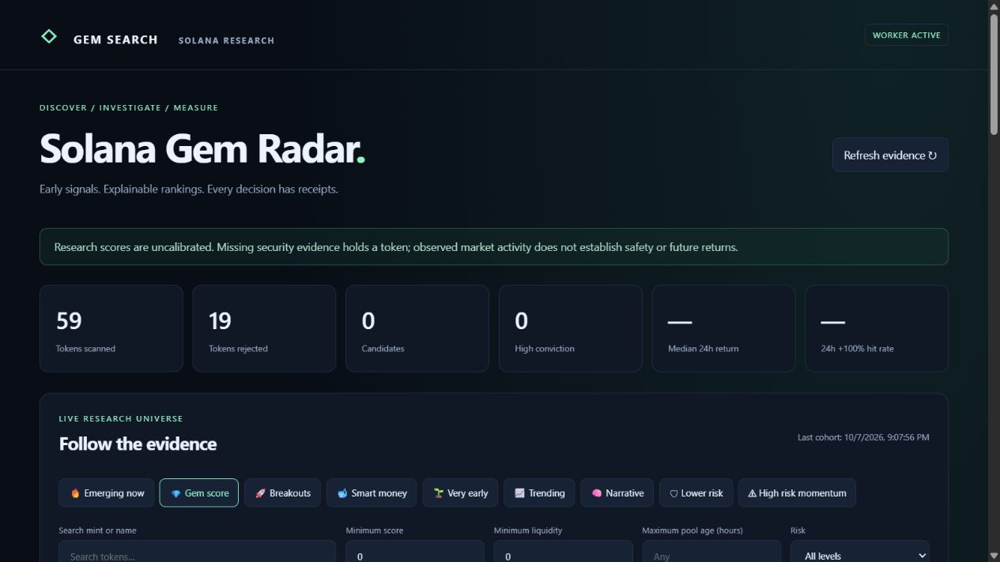
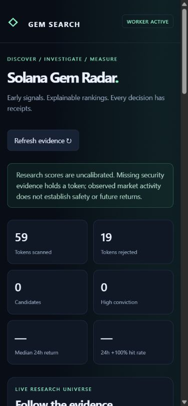

# Validation status — 2026-10-08

This is a tested discovery/research foundation. The complete production mission
has **not** met all acceptance criteria.

## Observed validation

- 68 Python tests pass (existing workbench plus radar).
- 18 JavaScript tests pass; radar JavaScript syntax check passes.
- Live first two collection cycles discovered 59 distinct mints: 36 first seen
  through GeckoTerminal new pools and 23 through DexScreener profiles.
- 97 provider market observations persisted; 31 initial frozen score decisions.
  These counts describe the initial probe, not predictive performance.
- RugCheck returned live authority/concentration/risk evidence. GeckoTerminal
  also returned HTTP 429; cooldowns and explicit provider gaps were observed.
- Dashboard, token dossier and baseline report load in a real browser.
  Mobile tested at 390×844: no page overflow; ranked table scrolls horizontally.
- Local HTTP authentication, read-only behavior and secret boundaries tested.
  Database triggers reject evidence mutation. Future-feature/capture exclusion,
  missing prices, liquidity removal, duplicate pools, provider disagreement,
  outage fallback and forward label idempotence are covered.
- Railway now connects to `avobati/gem-search`, branch `feat/solana-discovery`.
  Docker build and deployment succeeded for commit `b013c78`. PostgreSQL and its
  persistent volume are online. New services use dashboard configuration because
  Railway's legacy config-as-code can no longer be enabled for new services.
- Hosted endpoint: https://gem-search-production.up.railway.app. HTTPS `/healthz`
  returns 200; protected endpoints return 401 without authentication. The domain
  routes to port 8080, matching the container's injected PORT. The user entered
  the private password directly in Railway; authenticated browser verification
  remains pending.
- A normal sign-in page replaces Chrome's blocked native Basic-authentication
  prompt. Eight-hour opaque sessions use HttpOnly/SameSite=Strict/Secure cookies
  on hosted domains, one-use login challenges and same-origin checks. Passwords
  are never included in cookies or logs. Existing explicit Basic API headers
  remain supported. Login/logout do not enable data or launch mutation.
- Independent finalized RPC mint probe returned SPL token program and authority
  evidence. Largest accounts were unavailable, explicitly preserved as missing.
  Six behavioral RPC/security tests plus query projection/cohort tests cover
  outages, partial evidence, conflicting authorities, Token-2022 holds and
  future-data exclusion. On-chain enrichment is enabled on Railway, bounded to
  two mints per ranking cycle. It does not establish wallet intelligence.
- Baseline reports and latest-cohort queries project required fields rather than
  loading historical raw research. Completed forward labels are not recalculated;
  observations are fetched once per mint per labeling pass.
- Account is a $5 / 30-day trial. No paid upgrade was performed; perpetual free
  24/7 capacity and backup recovery have not been established.

## Measured performance

Backtest: unavailable; no historical point-in-time token dataset supplied.
Out-of-sample: unavailable; no mature independent folds yet.
Forward testing: collecting. The local export has 31,078 frozen decisions and
10,040 horizon labels at its latest snapshot. No observed six-hour outcomes in
the selected baseline cohorts were available; labels include missing exits.
Repeated decisions are correlated, and these counts are not token counts or
evidence of prediction accuracy. No live hosted return claims yet.
Hit rate, median return and winner recall: **unknown**, not zero.

`python -m radar.evaluate` exports current baseline metrics and walk-forward
experiments. Folds require chronological train/validation/test periods with
seven-day embargoes. Weight alternatives are predeclared, selected on validation,
and frozen before test evaluation. No experiment changes production weights.

## Remaining acceptance work

1. Complete authenticated hosted UI, worker readiness and durable-data checks.
2. Confirm ongoing free-resource capacity; trial credit does not prove perpetual
   24/7 operation. Validate backups, workload, database sizes and provider budgets.
3. Add transaction-level wallet/holder history and creator attribution. Current
   smart-wallet score, whale accumulation and holder velocity are unknown.
4. Add launch/migration subscriptions for Pump, Raydium and Meteora. Current
   discovery is aggregator pool/profile coverage, not a complete on-chain stream.
5. Connect a licensed unattended social source. Existing captures/JEV integration
   works where captures are available, but browser collection requires a browser.
6. Validate sell restrictions, Token-2022 extensions, LP owner/lock conditions,
   creator history and suspicious transfer clusters with independent on-chain data.
7. Accumulate mature forward cohorts; measure baselines, missing-exit sensitivity,
   unique-token cohort metrics, drawdown and observed-universe recall.
8. Calibrate horizon models and assess walk-forward performance before any
   predictive confidence or trading claim.

